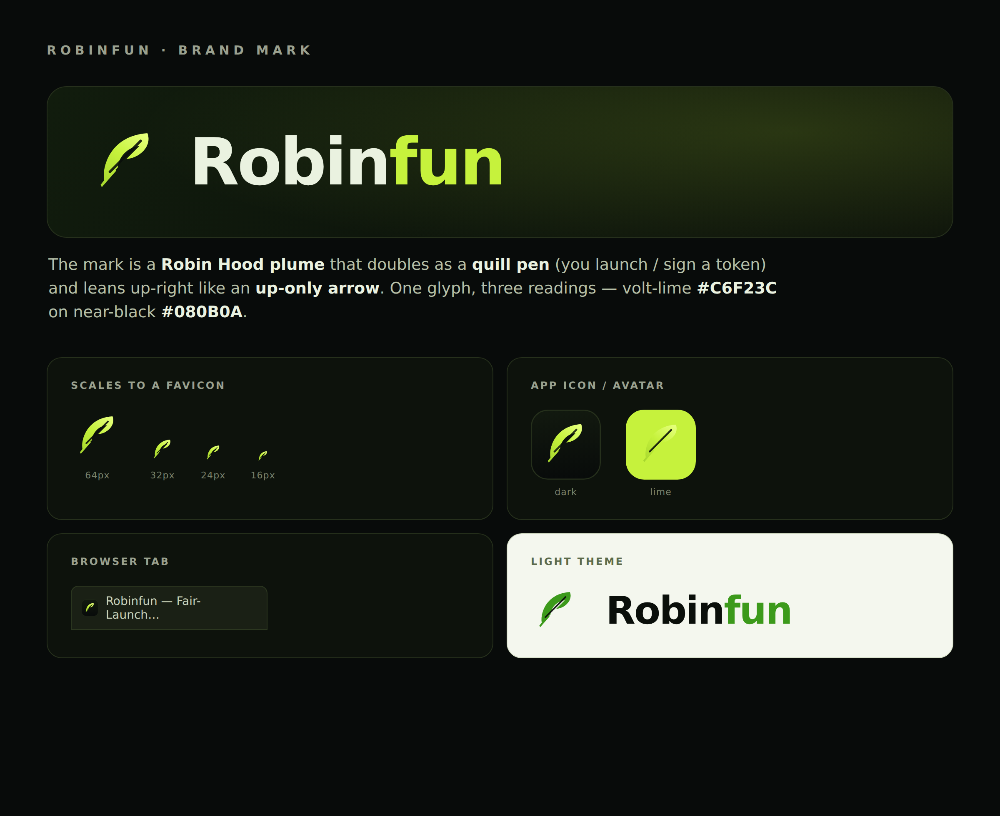

# Robinfun — brand assets

The Robinfun mark is a **Robin Hood plume / quill** that also reads as an
**up-only arrow** — one glyph, three meanings (the robin's feather, the quill
you "sign"/launch a token with, and a rising chart). Volt-lime on near-black,
matching the product's design tokens.



## Files

| File | What it is | Use for |
|---|---|---|
| `robinfun-mark.svg` | Feather mark, gradient, transparent background | the logo on any dark surface |
| `robinfun-icon.svg` | Feather on a rounded near-black badge | favicon, app icon, social avatar |
| `robinfun-lockup.svg` | Mark + `Robinfun` wordmark, horizontal | headers, docs, README banners |
| `robinfun-mark.png` | 512px transparent render of the mark | quick previews / raster needs |
| `robinfun-icon.png` | 512px render of the app icon | store listings, avatars |
| `brand-sheet.png` | This overview sheet | reference |

The mark is also **inlined** into the site (`deploy/site/index.html` and
`docs/robinfun-prototype.html`) — topbar, hero, and an SVG-data-URI favicon —
so there is no external asset request. Edit the paths in those files if the
mark changes; the canonical geometry lives in `robinfun-mark.svg`.

## Palette

| Token | Hex | Role |
|---|---|---|
| `--ink` | `#080B0A` | page ground (near-black) |
| `--gilt` | `#C6F23C` | brand accent (volt-lime) |
| lime gradient | `#A6D62E → #C6F23C → #E4FF7A` | the feather fill |
| light-mode green | `#3C9A1B` | mark/wordmark accent on light surfaces |
| `--seal` | `#FF5B4A` | alert / sell red |

Type: **Space Grotesk** (display / wordmark), Instrument Sans (body),
IBM Plex Mono (numerals). The wordmark is `Robin` in cream + `fun` in gilt.

## Regenerating the PNGs

The PNGs are rendered from the SVGs with headless Chromium (no design tool
needed):

```bash
chrome --headless=new --default-background-color=00000000 \
  --window-size=512,512 --screenshot=robinfun-mark.png robinfun-mark.svg
```
