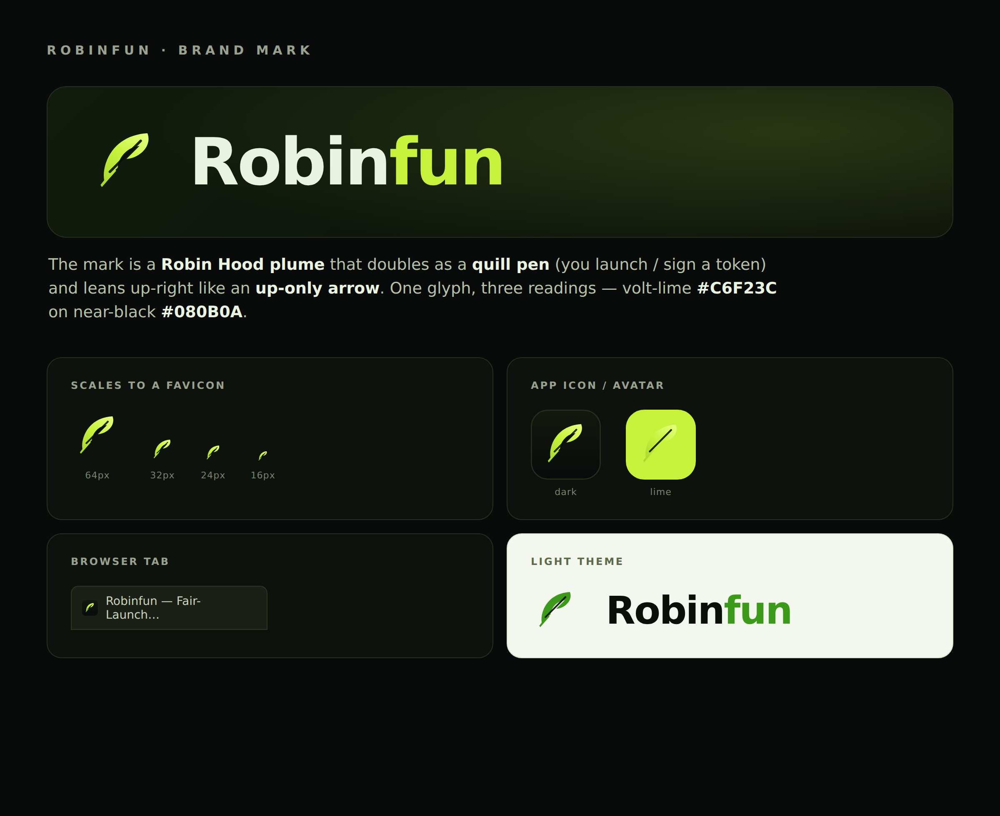

# Robinfun — brand assets

The Robinfun mark is a **Robin Hood plume / quill** that also reads as an
**up-only arrow** — one glyph, three meanings (the robin's feather, the quill
you "sign"/launch a token with, and a rising chart). Champagne gold on true
black ("Obsidian & Champagne"), matching the product's design tokens.



## Files

| File | What it is | Use for |
|---|---|---|
| `robinfun-mark.svg` | Feather mark, gradient, transparent background | the logo on any dark surface |
| `robinfun-icon.svg` | Feather on a rounded near-black badge | favicon, app icon, social avatar |
| `robinfun-lockup.svg` | Mark + `Robinfun` wordmark, horizontal | headers, docs, README banners |
| `robinfun-mark.png` | 512px transparent render of the mark | quick previews / raster needs |
| `robinfun-icon.png` | 512px render of the app icon | store listings, avatars |
| `robinfun-x-pfp.png` | 800×800 avatar (feather + glow rings) | X / Twitter profile photo (crops to a circle) |
| `robinfun-x-header.png` | 1500×500 banner (lockup + tagline + chart) | X / Twitter header |
| `robinfun-x-*.html` | source pages for the two X assets | re-render if copy/size changes |
| `brand-sheet.png` | This overview sheet | reference |

### Social assets (X / Twitter)

- **Profile photo** — upload `robinfun-x-pfp.png`. It is 800×800 (X crops to a
  circle; the glow rings sit inside the circle so nothing important is clipped).
- **Header** — upload `robinfun-x-header.png` (1500×500, X's native size). The
  bottom-left is kept clear so the profile photo overlay never covers the
  wordmark or tagline.

Both are rendered from the HTML sources with headless Chromium at **device
scale 1** and the canvas pinned with `position:absolute` + explicit pixel
height (a headless-viewport quirk leaves a strip at the bottom otherwise):

```bash
chrome --headless=new --hide-scrollbars --window-size=800,800 \
  --screenshot=robinfun-x-pfp.png robinfun-x-pfp.html
chrome --headless=new --hide-scrollbars --window-size=1500,500 \
  --screenshot=robinfun-x-header.png robinfun-x-header.html
```

The mark is also **inlined** into the site (`deploy/site/index.html` and
`docs/robinfun-prototype.html`) — topbar, hero, and an SVG-data-URI favicon —
so there is no external asset request. Edit the paths in those files if the
mark changes; the canonical geometry lives in `robinfun-mark.svg`.

## Palette — "Obsidian & Champagne"

| Token | Hex | Role |
|---|---|---|
| `--ink` | `#000000` | page ground (true black) |
| `--ledger` | `#0A0A0A` | card / panel surface |
| `--cream` | `#F5F3EE` | primary text (warm white) |
| `--gilt` | `#D4B574` | brand accent (champagne gold) |
| gold gradient | `#A8874A → #DCC089 → #F6E7C1` | the feather fill |
| light-mode gold | `#8C6D2F` | mark/wordmark accent on light surfaces |
| `--jade` | `#3ECF8E` | buys / positive (calm emerald) |
| `--seal` | `#F0595F` | sells / negative (rose) |

Type: **Inter Tight** (display), **Instrument Serif** italic (the `fun` in the
wordmark + editorial accents), Inter (body), JetBrains Mono (numerals). The
wordmark is `Robin` in warm white + `fun` in gold serif italic.

## Regenerating the PNGs

The PNGs are rendered from the SVGs with headless Chromium (no design tool
needed):

```bash
chrome --headless=new --default-background-color=00000000 \
  --window-size=512,512 --screenshot=robinfun-mark.png robinfun-mark.svg
```
